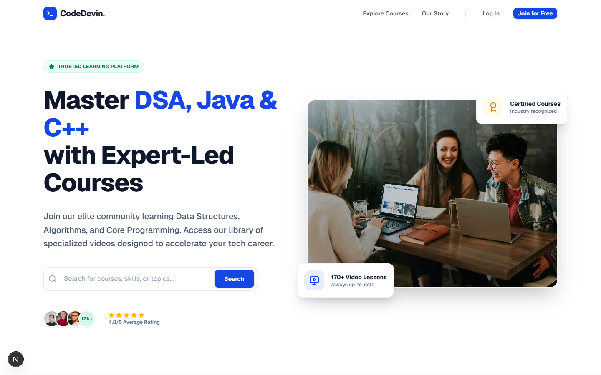
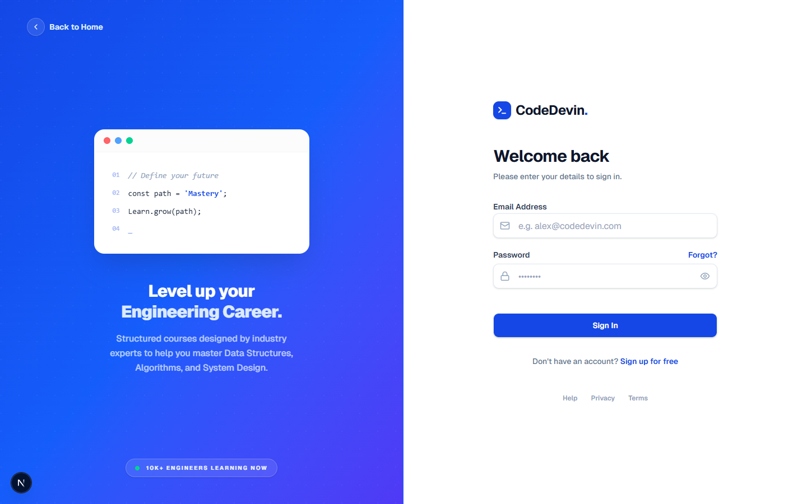
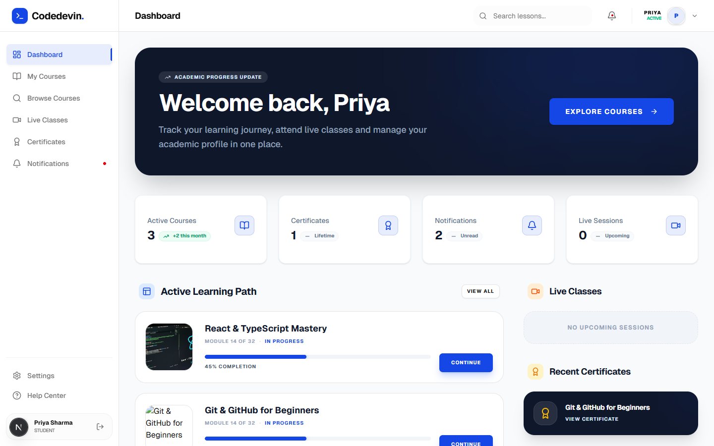
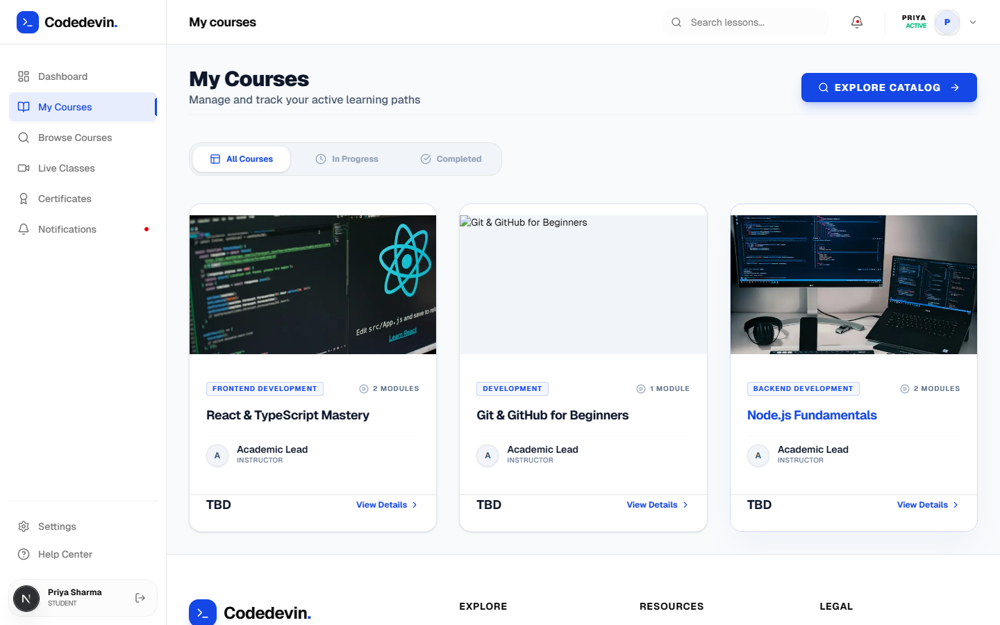
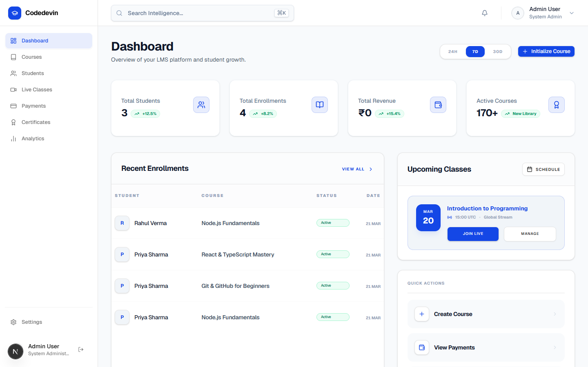
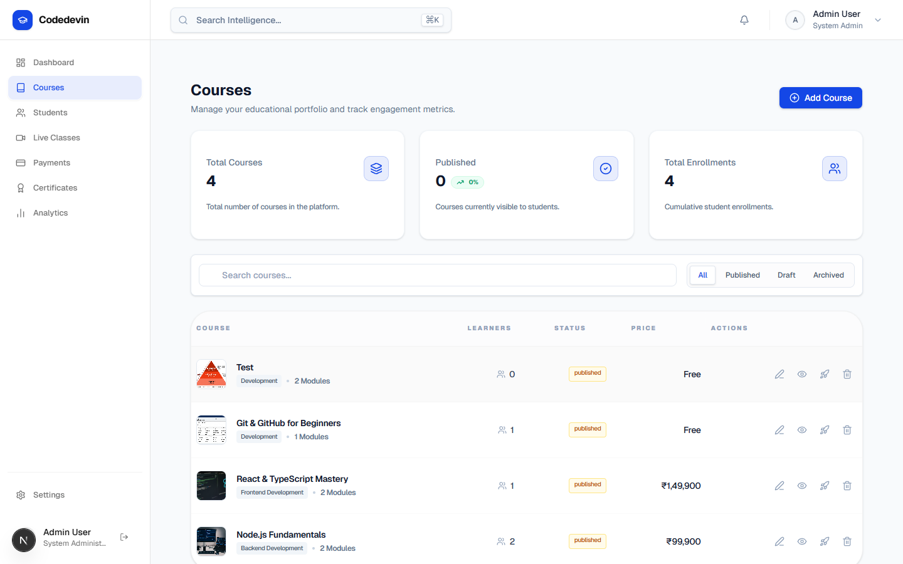
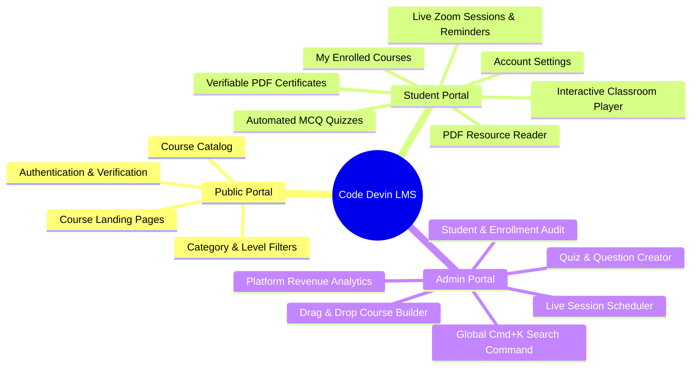
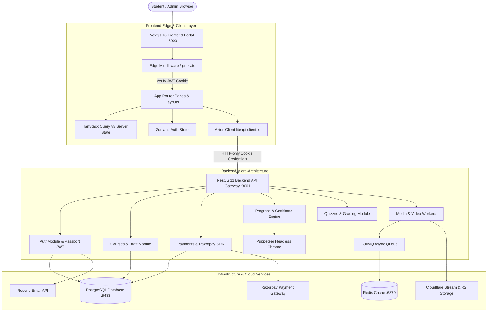
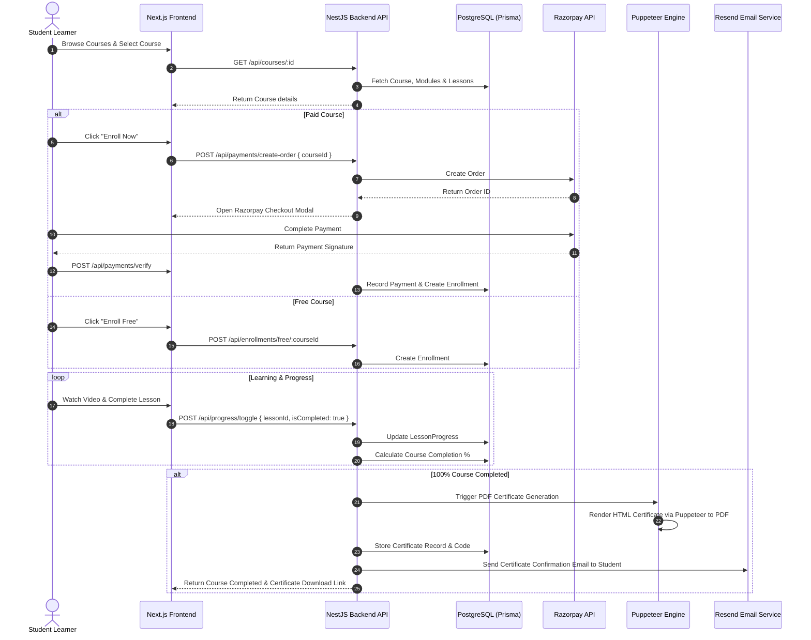

# Code Devin Solutions — Learning Management System (LMS)

A full-stack, enterprise-grade **Learning Management System (LMS)** designed and engineered for **Code Devin Solutions**. Built with a high-performance **Next.js 16 App Router** frontend and a modular **NestJS 11** micro-architecture backend backed by **PostgreSQL**, **Prisma ORM**, **Redis**, **BullMQ**, and third-party integrations (Razorpay, Resend, Cloudflare Stream/R2, Puppeteer).

---

## 📋 Table of Contents

- [Executive Summary & Purpose](#-executive-summary--purpose)
- [Live Application Preview & Screenshots](#-live-application-preview--screenshots)
- [Product Vision & Core Features](#-product-vision--core-features)
- [Overall System Architecture](#-overall-system-architecture)
- [End-to-End System Data Flow](#-end-to-end-system-data-flow)
- [Technology Stack Breakdown](#-technology-stack-breakdown)
- [Monorepo Directory Structure](#-monorepo-directory-structure)
- [Sub-System Documentation Index](#-sub-system-documentation-index)
- [Security & Protected Environment Variables](#-security--protected-environment-variables)
- [Developer Quick Start & Local Setup](#-developer-quick-start--local-setup)

---

## 🚀 Executive Summary & Purpose

The **Code Devin Solutions LMS** provides a centralized, professional platform for delivering structured technology courses (e.g., Node.js, React, TypeScript, Git, Data Structures & Algorithms).

### Core Objectives:
1. **Admin-Controlled Curation**: Single administrative entity creates, structures, and publishes high-quality courses with nested modules, video lessons, PDF resources, and interactive quizzes.
2. **Seamless Student Experience**: Frictionless course discovery, instant free enrollment, integrated Razorpay payment gateway for paid courses, and intuitive learning progress tracking.
3. **Automated Verifiable Certification**: Headless Puppeteer engine dynamically generates official PDF certificates upon 100% course completion, complete with verifiable QR/unique codes.
4. **Live & Asynchronous Learning**: Scheduled Zoom live interactive sessions with automatic reminder notifications and post-session recording publishing.

---

## 📸 Live Application Preview & Screenshots

Below are real captured screenshots from the active running application:

### 1. Public Portal & Landing Page
Explore available courses, filter by category/level, and view course details.


---

### 2. Authentication Portal
Secure student registration, email verification, and role-based login portal.


---

### 3. Student Learning Dashboard
Track course completion percentages, resume active lessons, and view notifications.


---

### 4. Student Enrolled Courses Portal
Access all enrolled courses and launch the interactive video & quiz classroom.


---

### 5. Admin Management Dashboard
Platform health overview, real-time revenue analytics, student enrollment counts, and system metrics.


---

### 6. Admin Interactive Course Management
Manage published & draft courses, launch the drag-and-drop course builder, and configure quizzes.


---

## 💡 Product Vision & Core Features



---

## 🏗 Overall System Architecture

The monorepo architecture cleanly separates the client-facing presentation layer (Next.js), edge security proxy, NestJS API gateway, relational data store, in-memory caching queues, and external cloud services:



---

## 🔄 End-to-End System Data Flow

The sequence diagram below demonstrates the complete lifecycle from student enrollment to certificate issuance:



---

## 🛠 Technology Stack Breakdown

### Frontend Technologies (`lms-frontend`)
- **Core Framework**: [Next.js 16](https://nextjs.org/) (App Router, Server & Client Components, React 19)
- **Styling & Design System**: [Tailwind CSS v4](https://tailwindcss.com/), Radix UI primitives, Lucide React icons, Sonner toasts
- **Drag & Drop Engine**: `@dnd-kit/core`, `@dnd-kit/sortable` (used in Admin Course Builder)
- **State Management & Caching**: [TanStack Query v5](https://tanstack.com/query) for server state; [Zustand](https://zustand-demo.pmnd.rs/) for auth state
- **HTTP Client & Security**: Axios interceptors with credentials, `jose` JWT edge proxy verification

### Backend Technologies (`lms-backend`)
- **Core Framework**: [NestJS 11](https://nestjs.com/) (Express platform, TypeScript)
- **Database & ORM**: [PostgreSQL](https://www.postgresql.org/), [Prisma ORM 6.4](https://www.prisma.io/)
- **Caching & Queues**: [Redis 7](https://redis.io/), [BullMQ](https://docs.bullmq.io/)
- **Authentication**: Passport.js (JWT & Local), HTTP-only cookies, bcrypt hashing, Helmet security headers, Throttler rate limiting
- **Integrations & Utilities**: Razorpay Node SDK, Resend Email API, Puppeteer PDF generation, Multer & Sharp image processing, Cloudflare Stream / R2 storage

### Infrastructure & DevOps
- **Containerization**: Docker & Docker Compose (`redis:7-alpine`)
- **Database Engine**: PostgreSQL running on port `5433`

---

## 📁 Monorepo Directory Structure

```
CodeDevinSolutions/
├── docker-compose.yml          # Redis container orchestration
├── README.md                   # Master project documentation (This file)
├── .gitignore                  # Root git ignore specification
│
├── lms-backend/                # NestJS 11 Backend Application
│   ├── prisma/                 # Database schema & seed scripts
│   ├── src/                    # Controllers, Services, Modules, DTOs
│   ├── test/                   # Jest e2e test suite
│   ├── README.md               # Detailed Backend README
│   └── package.json            # Backend dependencies
│
├── lms-frontend/               # Next.js 16 Frontend Portal
│   ├── src/                    # App Router pages, components, hooks, stores
│   ├── public/                 # Static web assets
│   ├── README.md               # Detailed Frontend README
│   └── package.json            # Frontend dependencies
│
├── docs/                       # Project screenshots and documentation assets
│   └── screenshots/            # Live application UI screenshots
│
└── Markdown/                   # Architecture & Design Specifications
    ├── PRD.md                  # Product Requirements Document
    ├── SYSTEM_DESIGN.md        # System Architecture Specification
    ├── TECH_STACK.md           # Technical Stack Reference
    ├── API_DESIGN.md           # REST API Contract Specification
    ├── DATABASE_SCHEMA.md      # Database Schema Specification
    ├── BACKEND_ARCHITECTURE.md # Backend Architecture Specification
    ├── FRONTEND_ARCHITECTURE.md# Frontend Architecture Specification
    ├── DESIGN.md               # UI/UX Design System Specification
    └── IMPLEMENTATION_PLAN.md  # Multi-Phase Implementation Plan
```

---

## 📚 Sub-System Documentation Index

For in-depth domain specs, code handoffs, and setup guides, refer to the dedicated documentation files:

| Document | Link | Description |
| :--- | :--- | :--- |
| **Backend README** | [`lms-backend/README.md`](file:///d:/Projects/CodeDevinSolutions/lms-backend/README.md) | Comprehensive API module guide, Prisma database ER diagram, Class diagram, and endpoint reference |
| **Frontend README** | [`lms-frontend/README.md`](file:///d:/Projects/CodeDevinSolutions/lms-frontend/README.md) | Component architecture, App Router guide, state management, and custom React Query hooks |

---

## 🔒 Security & Protected Environment Variables

> [!IMPORTANT]
> All sensitive configuration variables—including database passwords, JWT secrets, payment gateway keys, and API tokens—are **strictly protected** and kept out of version control via `.gitignore`.

### Environment Setup Blueprint:
1. **Backend Environment Setup**: Create `lms-backend/.env` based on `lms-backend/.env.example`.
2. **Frontend Environment Setup**: Create `lms-frontend/.env.local` based on `lms-frontend/.env.example`.
3. Never commit raw `.env` or `.env.local` files to git repositories.

---

## 🚀 Developer Quick Start & Local Setup

### Prerequisites
- **Node.js**: `v20.x` or later
- **npm**: `v10.x` or later
- **Docker Desktop**: Required for Redis container & PostgreSQL database

---

### Step-by-Step Setup Guide

#### 1. Clone & Start Infrastructure Services
From the workspace root directory:
```bash
# Start Redis cache container
docker-compose up -d
```

---

#### 2. Configure & Start Backend Server (`lms-backend`)
```bash
# Navigate to backend directory
cd lms-backend

# Install dependencies
npm install

# Copy environment variables blueprint & populate local keys
cp .env.example .env

# Run database migrations & seed database
npx prisma migrate dev --name init
npm run db:seed

# Start backend server in development mode
npm run start:dev
```
Backend API will be running at: **`http://localhost:3001/api`**

---

#### 3. Configure & Start Frontend Server (`lms-frontend`)
In a new terminal window:
```bash
# Navigate to frontend directory
cd lms-frontend

# Install dependencies
npm install

# Copy environment variables blueprint
cp .env.example .env.local

# Start Next.js development server
npm run dev
```
Frontend Portal will be running at: **`http://localhost:3000`**

---

### 🌐 Accessing the Application
- **Public Portal**: `http://localhost:3000`
- **Student Dashboard**: `http://localhost:3000/dashboard`
- **Admin Dashboard**: `http://localhost:3000/admin/dashboard`
- **Backend API**: `http://localhost:3001/api`
