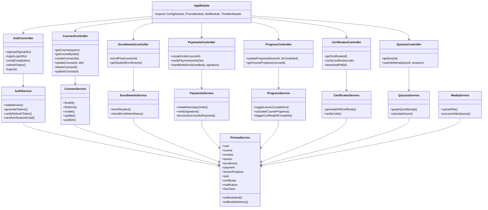
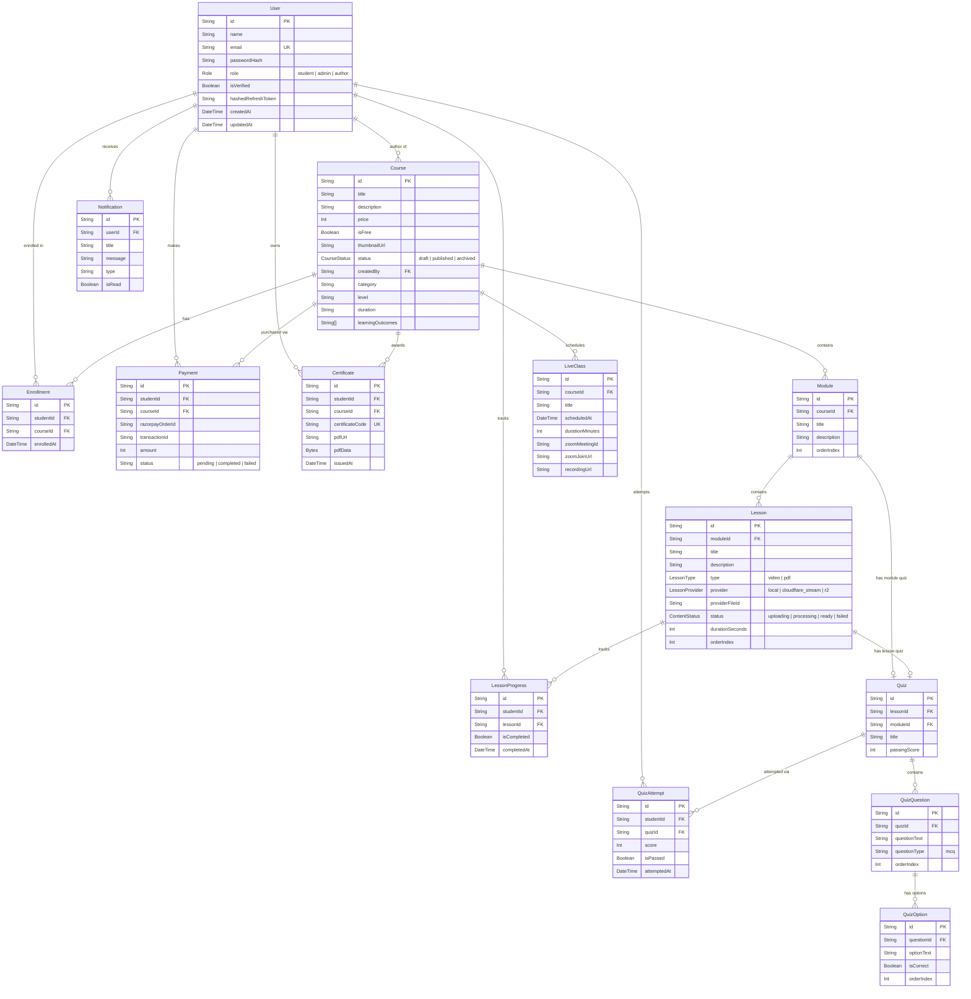
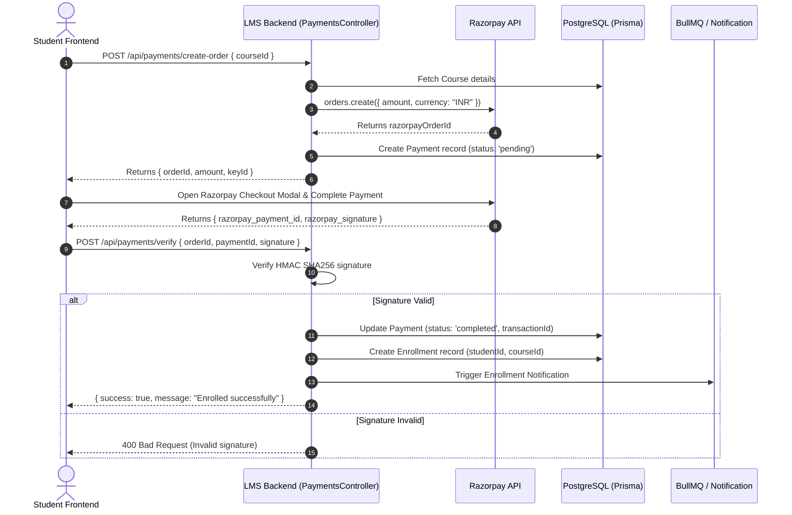
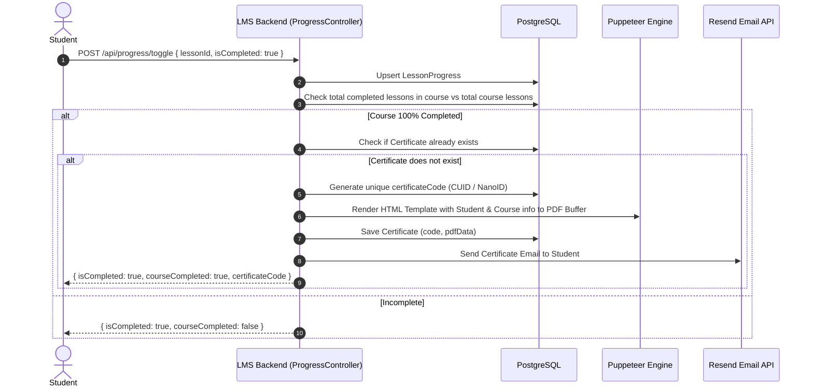

# LMS Backend - Learning Management System API

A enterprise-grade, high-performance Learning Management System (LMS) backend built with **NestJS 11**, **PostgreSQL**, **Prisma ORM**, **Redis**, and **BullMQ**. Designed for scalability, clean modular architecture, secure authentication, async processing, and seamless third-party integrations (Razorpay, Resend, Cloudflare Stream/R2, Puppeteer).

---

## 📋 Table of Contents

- [Overview & Capabilities](#-overview--capabilities)
- [Tech Stack & Architecture](#-tech-stack--architecture)
- [System Architecture & Class Diagram](#-system-architecture--class-diagram)
- [Database ER Diagram](#-database-er-diagram)
- [System Sequence & Data Flow Diagrams](#-system-sequence--data-flow-diagrams)
- [Key Implemented Modules](#-key-implemented-modules)
- [Project Directory Structure](#-project-directory-structure)
- [Prerequisites & Infrastructure](#-prerequisites--infrastructure)
- [Installation & Getting Started](#-installation--getting-started)
- [Database Management (Prisma)](#-database-management-prisma)
- [Developer Handoff Guide: How to Extend](#-developer-handoff-guide-how-to-extend)
- [API Route Reference Summary](#-api-route-reference-summary)
- [Troubleshooting & Common Issues](#-troubleshooting--common-issues)

---

## 🚀 Overview & Capabilities

The LMS Backend handles the full lifecycle of online learning platform operations:
1. **User Authentication & Role Management**: Multi-role support (`student`, `author`, `admin`), JWT authentication, HTTP-only cookie tokens, password hashing with `bcrypt`, and email verification using `Resend`.
2. **Course & Content Management**: Hierarchical course creation (`Course` → `Module` → `Lesson`), draft/publish workflow, pricing (free vs. paid), and rich metadata.
3. **Interactive Quizzes & Assessments**: MCQ quiz builders, automated scoring, pass/fail thresholds, and student attempt logs.
4. **Learning Progress & Certificates**: Real-time lesson progress tracking, automatic course completion detection, and automated PDF certificate generation via headless **Puppeteer**.
5. **E-Commerce & Payments**: Seamless Razorpay payment gateway integration with order creation, signature verification, and webhook handling.
6. **Async Media & Video Pipelines**: Media upload handling, background video transcoding/processing using **Redis** and **BullMQ**, and Cloudflare Stream / Cloudflare R2 abstraction.
7. **Live Classes**: Zoom live class scheduling, join links, and recording management.
8. **Admin Analytics & Management**: System-wide revenue, enrollment metrics, student management, and global search services.

---

## 🛠 Tech Stack & Architecture

| Layer | Technology | Description |
| :--- | :--- | :--- |
| **Framework** | [NestJS 11](https://nestjs.com/) | Progressive Node.js framework (TypeScript) using Express platform |
| **Database** | [PostgreSQL](https://www.postgresql.org/) | Relational database engine |
| **ORM** | [Prisma 6.4](https://www.prisma.io/) | Type-safe database client and migration tool |
| **Cache & Queues** | [Redis 7](https://redis.io/) & [BullMQ](https://docs.bullmq.io/) | In-memory store and async job queues for background tasks |
| **Authentication** | [Passport.js](http://www.passportjs.org/) + JWT | JWT Access & Refresh tokens via HTTP-only cookies |
| **Email Service** | [Resend](https://resend.com/) | Transactional email delivery |
| **Payments** | [Razorpay SDK](https://razorpay.com/) | Payment gateway for course purchases & webhook validation |
| **PDF Generation** | [Puppeteer](https://pptr.dev/) | Headless Chrome engine for server-side HTML-to-PDF certificate rendering |
| **Media & Storage** | Multer, Sharp, Cloudflare Stream / R2 | Image processing, storage abstraction, and video streaming |
| **Security & Utilities** | Helmet, Cookie-Parser, `@nestjs/throttler` | Rate limiting, cookie management, and security headers |

---

## 🏗 System Architecture & Class Diagram

The application uses NestJS's modular architecture where each domain feature is encapsulated in a dedicated NestJS module containing its controller, service, DTOs, and Prisma repositories.



---

## 🗄 Database ER Diagram

The database uses PostgreSQL managed via Prisma ORM. Below is the Entity-Relationship diagram:



---

## 🔄 System Sequence & Data Flow Diagrams

### 1. Payment & Enrollment Flow (Razorpay)



### 2. Auto Certificate Generation Flow



---

## 📦 Key Implemented Modules

| Module Name | Path | Key Functionality |
| :--- | :--- | :--- |
| `AuthModule` | `src/auth` | Login, signup, JWT token generation, refresh token rotation, email verification guard |
| `UsersModule` | `src/users` | User profile management, password updates, admin student management |
| `CoursesModule` | `src/courses` | Public course catalog, category filtering, author course management, module/lesson nesting |
| `EnrollmentsModule`| `src/enrollments` | Student course enrollments, free course instant access, enrollment status verification |
| `PaymentsModule` | `src/payments` | Razorpay order creation, signature validation, webhook consumer |
| `ProgressModule` | `src/progress` | Lesson progress tracking, completion calculations, auto-trigger certificate engine |
| `CertificatesModule`| `src/certificates`| Dynamic PDF generation using Puppeteer, public certificate validation endpoint |
| `QuizzesModule` | `src/quizzes` | MCQ quiz creation, attempt submission, automated grading, pass/fail thresholds |
| `LiveClassesModule`| `src/live-classes` | Live class scheduling, Zoom link integration, recording link publishing |
| `AdminModule` | `src/admin` | Revenue analytics, overall system stats, user list management |
| `NotificationsModule`| `src/notifications`| User alert dispatching, unread count query, mark-as-read endpoints |
| `MediaModule` | `src/media` | Image and resource file uploads via Multer and Sharp optimization |
| `VideosModule` | `src/videos` | Cloudflare Stream and R2 video upload/processing pipeline |
| `DraftModule` | `src/draft` | Course creation auto-save draft functionality |

---

## 📁 Project Directory Structure

```
lms-backend/
├── prisma/
│   ├── schema.prisma       # Database schema & entity definitions
│   └── seed.ts             # Database seeding script (Admin, sample courses)
├── public/                 # Static asset directory served at /public/
├── src/
│   ├── main.ts             # NestJS app entrypoint (CORS, Pipes, Helmet, Cookies)
│   ├── app.module.ts       # Main root module configuring all sub-modules
│   ├── app.controller.ts   # Root health check endpoint
│   ├── admin/              # Admin analytics and metrics module
│   ├── auth/               # Passport JWT strategies, AuthController & AuthService
│   ├── certificates/       # Puppeteer PDF certificate generation
│   ├── courses/            # Course, Module & Lesson controllers/services
│   ├── draft/              # Draft auto-save module
│   ├── enrollments/        # Enrollment logic & guards
│   ├── live-classes/       # Zoom integration & live sessions
│   ├── media/              # Media upload & Cloudflare R2 integration
│   ├── notifications/      # Notification dispatch system
│   ├── payments/           # Razorpay payment & webhook logic
│   ├── prisma/             # PrismaService provider
│   ├── progress/           # Lesson progress & percentage completion
│   ├── quizzes/            # Quiz builder, questions, options, & evaluation
│   ├── users/              # User profile & administration
│   └── videos/             # Cloudflare Stream video processing & BullMQ workers
├── test/                   # Jest e2e testing suite
├── .env.example            # Environment variables blueprint
├── docker-compose.yml      # (Root) Redis container setup
├── nest-cli.json           # Nest CLI configuration
├── package.json            # Dependencies & npm scripts
└── tsconfig.json           # TypeScript configuration
```

---

## ⚡ Prerequisites & Infrastructure

Before starting the backend, make sure you have installed:
1. **Node.js** (v18.x or v20.x recommended)
2. **npm** (v9+ or v10+)
3. **Docker Desktop** (or local PostgreSQL & Redis servers)
4. **PostgreSQL Database** running on port `5433` (or update `DATABASE_URL` in `.env`)
5. **Redis Server** running on port `6379` (managed via Docker Compose)

---

## 🚀 Installation & Getting Started

### 1. Start Infrastructure (Redis & Database)
From the root workspace directory:
```bash
docker-compose up -d
```

### 2. Install Backend Dependencies
```bash
cd lms-backend
npm install
```

### 3. Run Database Migrations & Seeds
```bash
npx prisma migrate dev --name init
npm run db:seed
```

### 4. Start Development Server
```bash
npm run start:dev
```
The NestJS server will start at: **`http://localhost:3001/api`**

---

## 🗃 Database Management (Prisma)

- **View & Manage DB via UI (Prisma Studio)**:
  ```bash
  npx prisma studio
  ```
- **Apply Schema Changes (Migration)**:
  ```bash
  npx prisma migrate dev --name <migration_name>
  ```
- **Generate Type-safe Prisma Client**:
  ```bash
  npx prisma generate
  ```
- **Re-seed Database**:
  ```bash
  npm run db:seed
  ```

---

## 👨‍💻 Developer Handoff Guide: How to Extend

### How to Add a New Feature / Entity

#### Step 1: Update Database Schema
Edit `prisma/schema.prisma` to add your model or update fields:
```prisma
model Review {
  id        String   @id @default(cuid())
  rating    Int
  comment   String
  studentId String
  courseId  String
  student   User     @relation(fields: [studentId], references: [id])
  course    Course   @relation(fields: [courseId], references: [id])
  createdAt DateTime @default(now())
}
```
Run `npx prisma migrate dev --name add_review_model` to update PostgreSQL and regenerate the Prisma Client.

#### Step 2: Generate Module Scaffold via Nest CLI
```bash
npx nest g module reviews
npx nest g controller reviews
npx nest g service reviews
```

#### Step 3: Implement Data Transfer Objects (DTOs)
Create DTOs in `src/reviews/dto/create-review.dto.ts` with validation decorators:
```typescript
import { IsInt, IsString, Min, Max } from 'class-validator';

export class CreateReviewDto {
  @IsInt()
  @Min(1)
  @Max(5)
  rating: number;

  @IsString()
  comment: string;
}
```

#### Step 4: Add Auth Guards & Role Controls
Use `@UseGuards(JwtAuthGuard, RolesGuard)` and `@Roles('student')` on controller methods:
```typescript
@UseGuards(JwtAuthGuard, RolesGuard)
@Roles('student')
@Post(':courseId')
async createReview(
  @Req() req,
  @Param('courseId') courseId: string,
  @Body() dto: CreateReviewDto,
) {
  return this.reviewsService.create(req.user.id, courseId, dto);
}
```

---

## 📑 API Route Reference Summary

All API endpoints are prefixed with `/api`.

### 🔐 Authentication (`/api/auth`)
- `POST /api/auth/signup` - Register a new user (`student` / `author`)
- `POST /api/auth/login` - Authenticate user & receive HTTP-only cookies
- `GET /api/auth/verify-email?token=...` - Confirm user email address
- `POST /api/auth/refresh` - Refresh access token using refresh cookie
- `POST /api/auth/logout` - Clear auth cookies and invalidate refresh hash

### 📚 Courses (`/api/courses`)
- `GET /api/courses` - List published courses (supports search, category, level query filters)
- `GET /api/courses/:id` - Fetch single course with modules, lessons, and public metadata
- `POST /api/courses` - *(Admin/Author)* Create a new course draft
- `PATCH /api/courses/:id` - *(Admin/Author)* Update course information
- `PATCH /api/courses/:id/publish` - *(Admin)* Change course status to published
- `DELETE /api/courses/:id` - *(Admin)* Delete course

### 📝 Course Builder & Content (`/api/courses/...`)
- `POST /api/courses/:courseId/modules` - Add module to course
- `PATCH /api/courses/modules/:moduleId` - Update module details / orderIndex
- `POST /api/courses/modules/:moduleId/lessons` - Add video/PDF lesson
- `PATCH /api/courses/lessons/:lessonId` - Update lesson metadata / orderIndex

### 💳 Payments & Enrollments (`/api/payments`, `/api/enrollments`)
- `POST /api/enrollments/free/:courseId` - Instant enrollment for free courses
- `GET /api/enrollments/my-courses` - List logged-in student's enrolled courses
- `POST /api/payments/create-order` - Create Razorpay order for paid course
- `POST /api/payments/verify` - Verify Razorpay payment signature & auto-enroll
- `POST /api/payments/webhook` - Razorpay server-to-server webhook callback

### 📊 Progress & Certificates (`/api/progress`, `/api/certificates`)
- `POST /api/progress/toggle` - Mark lesson as completed/incomplete
- `GET /api/progress/course/:courseId` - Fetch percentage completion & completed lesson IDs
- `GET /api/certificates/:id` - Download PDF certificate
- `GET /api/certificates/verify/:code` - Public verification of certificate authenticity

### 🧠 Quizzes (`/api/quizzes`)
- `GET /api/quizzes/:id` - Fetch quiz questions for lesson or module
- `POST /api/quizzes/:id/attempt` - Submit answers, receive automated grade score

### 🛡 Admin Portal (`/api/admin`)
- `GET /api/admin/analytics` - Fetch platform revenue, user growth, and enrollment metrics
- `GET /api/admin/students` - List all registered students and their course activity

---

## 🔍 Troubleshooting & Common Issues

| Symptom | Cause | Solution |
| :--- | :--- | :--- |
| `Can't reach database server at localhost:5433` | PostgreSQL container/service is not running | Ensure PostgreSQL is active on port `5433` or check `DATABASE_URL` in `.env` |
| `Redis connection error: ECONNREFUSED 127.0.0.1:6379` | Docker Redis container is stopped | Run `docker-compose up -d` from the root workspace folder |
| `PrismaClientKnownRequestError` on seed | Database schema out of sync | Run `npx prisma migrate dev` before running `npm run db:seed` |
| `CORS Error` on frontend API calls | Frontend URL mismatched in `.env` | Verify `FRONTEND_URL=http://localhost:3000` matches your Next.js app port |
| `Puppeteer launch error` during certificate generation | Missing Chromium dependencies on Linux/Docker | Install `chromium` system package or use `PUPPETEER_EXECUTABLE_PATH` |
| Razorpay Payment Signature Validation Failed | Mismatched Key Secret | Verify `RAZORPAY_KEY_SECRET` matches the key used by frontend Razorpay checkout |
