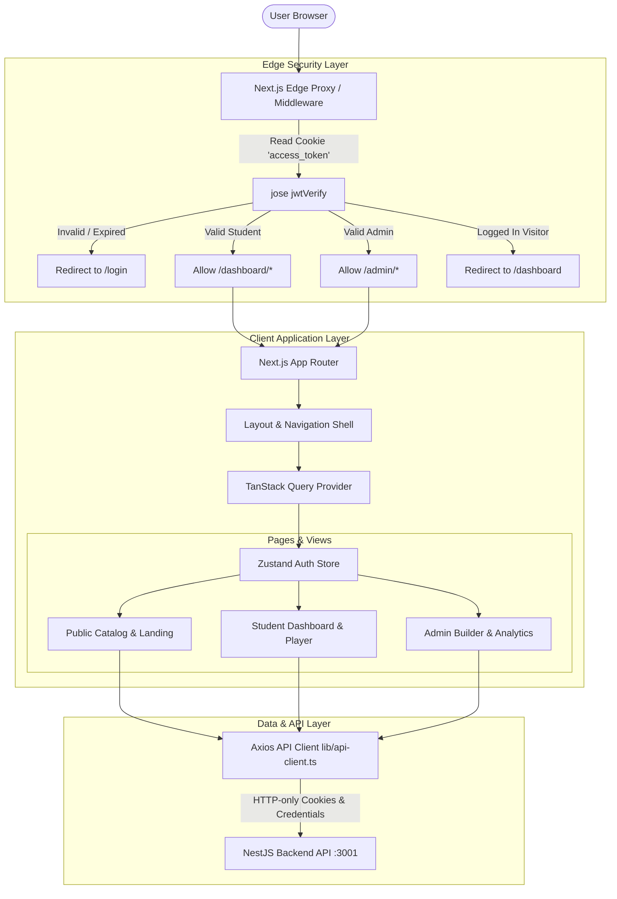
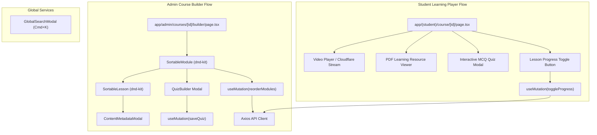

# LMS Frontend - Next.js Learning Management System Portal

A state-of-the-art, high-performance web portal built with **Next.js 16 (App Router)**, **React 19**, **Tailwind CSS v4**, **TanStack Query (React Query v5)**, **Zustand**, and **Radix UI / Shadcn**. Designed for modern learning experiences with interactive video players, dynamic drag-and-drop course builders, real-time progress updates, certificate management, Razorpay payment flows, and role-protected student/admin dashboards.

---

## 📋 Table of Contents

- [Overview & User Experience](#-overview--user-experience)
- [Tech Stack & Frameworks](#-tech-stack--frameworks)
- [Frontend Architecture & System Diagram](#-frontend-architecture--system-diagram)
- [Component Hierarchy & Flow Diagram](#-component-hierarchy--flow-diagram)
- [Key Implemented Portals & Routes](#-key-implemented-portals--routes)
- [State Management & Data Fetching](#-state-management--data-fetching)
- [Project Directory Structure](#-project-directory-structure)
- [Environment Configuration (.env.local)](#-environment-configuration-envlocal)
- [Installation & Development Setup](#-installation--development-setup)
- [Developer Handoff Guide: How to Extend](#-developer-handoff-guide-how-to-extend)
- [Troubleshooting & Common Issues](#-troubleshooting--common-issues)

---

## 🚀 Overview & User Experience

The LMS Frontend offers an intuitive, accessible, and ultra-responsive experience tailored for three primary user personas:
1. **Public Visitors**: Explore public course catalogs, filter by category/difficulty, inspect course landing pages, register, verify email, and authenticate.
2. **Students**:
   - Access **My Courses** dashboard and track individual completion percentages.
   - Interactive learning view with video playback, downloadable PDF notes, and quiz modals.
   - Auto-generated **PDF Certificate** download upon 100% course completion.
   - Schedule viewing and direct Zoom launch for **Live Classes**.
   - Account settings and in-app notifications.
3. **Admins / Instructors**:
   - **Interactive Course Builder**: Reorder modules and lessons seamlessly using drag-and-drop powered by `@dnd-kit`.
   - **Quiz & Assessment Builder**: Create MCQ questions, define correct choices, and set passing thresholds.
   - **Global Command Palette (`Cmd+K` / `Ctrl+K`)**: Instant search across courses, student records, and quick admin actions.
   - **Analytics & Revenue Portal**: Real-time revenue charts, student enrollment counts, and system metrics.

---

## 🛠 Tech Stack & Frameworks

| Category | Technology | Description |
| :--- | :--- | :--- |
| **Framework** | [Next.js 16](https://nextjs.org/) | React 19 framework using App Router, Server Components & Edge Middleware |
| **UI Styling** | [Tailwind CSS v4](https://tailwindcss.com/) | Utility-first CSS engine with dark mode support (`next-themes`) |
| **Primitives & UI** | [Radix UI](https://www.radix-ui.com/) & [Shadcn UI](https://ui.shadcn.com/) | Accessible headless components (Dialogs, Dropdowns, Tabs, Alerts) |
| **Icons & Magic UI** | Lucide React & `@21st-dev/magic` | Modern icon library and polished UI components |
| **Drag & Drop** | `@dnd-kit` (Core, Sortable, Utilities) | Drag-and-drop module/lesson reordering in the admin course builder |
| **Server State & Cache** | [TanStack Query v5](https://tanstack.com/query) | Async state management, caching, optimistic updates, and refetching |
| **Client Auth State** | [Zustand](https://zustand-demo.pmnd.rs/) | Lightweight client store (`auth.store.ts`) for active user profile |
| **HTTP Client** | Axios | Custom client (`lib/api-client.ts`) with credentials & automatic token refresh retry logic |
| **Edge Security** | `jose` JWT | Edge middleware protection (`proxy.ts`) verifying JWT cookies before page rendering |
| **Toasts & Feedback** | [Sonner](https://sonner.emilkowal.ski/) | Opinionated toast notifications for user actions |

---

## 🏗 Frontend Architecture & System Diagram

The frontend architecture cleanly decouples Edge Middleware, Client Routing, Async State Management, and API Client interceptors.



---

## 🧩 Component Hierarchy & Flow Diagram

The diagram below maps how UI pages interact with specialized components and state hooks:



---

## 🚪 Key Implemented Portals & Routes

### 🌐 1. Public Routes (`src/app/...`)
- `/` - Public landing page featuring course highlights, benefits, and category navigation.
- `/courses` - Public course catalog with keyword search and category filters.
- `/courses/[id]` - Detailed course landing page with syllabus outline, price, author info, and enroll trigger.
- `/login` - Student/Admin login form with email/password authentication.
- `/register` - New student registration form.
- `/verify-email` - Email verification confirmation screen.
- `/about` - Platform about page.

### 🎓 2. Student Portal (`src/app/(student)/...`)
- `/dashboard` - Overview of enrolled courses, recent activity, and completion statistics.
- `/my-courses` - List of all enrolled courses with quick resume buttons.
- `/course/[id]` - **Interactive Course Classroom** with video player, PDF reader, lesson list, and quiz taker.
- `/certificates` - View earned certificates with direct PDF download links.
- `/live-classes` - Schedule of upcoming live interactive sessions with Zoom join URLs.
- `/notifications` - Personal account notifications feed.
- `/settings` - Profile customization and security settings.

### 🛡 3. Admin Portal (`src/app/admin/...`)
- `/admin/dashboard` - Platform health overview, active student count, and revenue metrics.
- `/admin/courses` - Course management table (Create, Edit, Publish, Archive, Delete).
- `/admin/courses/[id]/builder` - **Drag-and-Drop Course Builder** for reordering modules and lessons, attaching media, and constructing quizzes.
- `/admin/students` - Student directory and course progress audit.
- `/admin/payments` - Transaction ledger and payment status log.
- `/admin/analytics` - Revenue and performance analytical charts.
- `/admin/certificates` - System certificate logs and verification audit.
- `/admin/live-classes` - Create and manage Zoom live class sessions.
- `/admin/notifications` - System notification dispatch tool.
- `/admin/settings` & `/admin/profile` - Administrative system settings.

---

## 🔄 State Management & Data Fetching

### 1. Edge Middleware Protection (`src/proxy.ts`)
Routing security is enforced at the edge before any page renders. `proxy.ts` verifies the `access_token` stored in HTTP-only cookies using `jose`:
- Prevents unauthenticated users from accessing `/dashboard/*` or `/admin/*`.
- Restricts non-admin users from accessing `/admin/*`.
- Automatically redirects authenticated users away from `/login` or `/register` to their role's dashboard.

### 2. Server State with TanStack Query (`@tanstack/react-query`)
All backend data fetching, caching, background refetching, and mutations are managed using React Query hooks located in `src/hooks/`:
- Automatic cache invalidation upon mutations (e.g. invalidating `['course', courseId]` after reordering lessons).
- Optimistic UI updates during progress toggling and module sorting.

### 3. Client State with Zustand (`src/stores/auth.store.ts`)
Lightweight client-side auth state holds the current user profile metadata (`id`, `email`, `name`, `role`, `isVerified`) for immediate UI updates without unnecessary page re-renders.

### 4. Custom Axios API Client (`src/lib/api-client.ts`)
Configured with `withCredentials: true` to handle cross-origin cookie authentication seamlessly. Automatically intercepts `401 Unauthorized` responses to attempt a refresh token exchange before retrying the original request.

---

## 📁 Project Directory Structure

```
lms-frontend/
├── src/
│   ├── app/                         # Next.js 16 App Router pages & layouts
│   │   ├── (student)/               # Protected student portal route group
│   │   │   ├── dashboard/           # Student home dashboard
│   │   │   ├── my-courses/          # Enrolled course list
│   │   │   ├── course/[id]/         # Classroom & player view
│   │   │   ├── certificates/        # Downloadable certificates
│   │   │   ├── live-classes/        # Scheduled Zoom sessions
│   │   │   ├── notifications/       # User notifications
│   │   │   └── settings/            # Profile settings
│   │   ├── admin/                   # Protected admin management portal
│   │   │   ├── analytics/           # Platform metrics
│   │   │   ├── certificates/        # Issued certificates audit
│   │   │   ├── courses/             # Course table & drag-and-drop builder
│   │   │   ├── dashboard/           # Admin home overview
│   │   │   ├── live-classes/        # Zoom session management
│   │   │   ├── notifications/       # Global notification tools
│   │   │   ├── payments/            # Transaction history
│   │   │   └── students/            # Registered student management
│   │   ├── courses/                 # Public course catalog & details
│   │   ├── login/                   # Login screen
│   │   ├── register/                # Registration screen
│   │   ├── verify-email/            # Email verification callback screen
│   │   ├── globals.css              # Tailwind CSS v4 directives & theme variables
│   │   ├── layout.tsx               # Root application layout & provider wrapping
│   │   └── page.tsx                 # Public landing page
│   ├── components/                  # UI components
│   │   ├── admin/                   # Admin builder, search modal & components
│   │   │   ├── course-builder/      # SortableModule, SortableLesson, QuizBuilder
│   │   │   └── GlobalSearchModal.tsx# Cmd+K search modal
│   │   ├── course/                  # Video player, lesson lists, quiz modal
│   │   ├── layout/                  # Navbar, Sidebar, Footer, UserMenu
│   │   ├── payment/                 # Razorpay modal checkout trigger
│   │   └── ui/                      # Radix & Shadcn primitive components
│   ├── hooks/                       # Custom React Query data fetching hooks
│   ├── lib/                         # Utility functions & Axios api-client.ts
│   ├── providers/                   # QueryClientProvider & ThemeProvider
│   ├── proxy.ts                     # Edge JWT middleware route guard
│   └── stores/                      # Zustand store (auth.store.ts)
├── .env.example                     # Environment blueprint
├── next.config.ts                   # Next.js configuration
├── tailwind.config.ts               # Tailwind CSS setup
├── components.json                  # Shadcn UI configuration
├── package.json                     # Dependencies & scripts
└── tsconfig.json                    # TypeScript compiler options
```

---

## ⚙️ Environment Configuration (.env.local)

Create a `.env.local` file inside `lms-frontend/`:

```env
# Backend API Base URL
NEXT_PUBLIC_API_URL=http://localhost:3001

# Razorpay Test Key (must match backend RAZORPAY_KEY_ID)
NEXT_PUBLIC_RAZORPAY_KEY_ID="rzp_test_mock_key"

# JWT Secret (used by Edge proxy to verify tokens client-side if needed)
JWT_SECRET="super-secret-jwt-key-for-dev-only"
```

---

## 🚀 Installation & Development Setup

### 1. Install Dependencies
```bash
cd lms-frontend
npm install
```

### 2. Run Development Server
```bash
npm run dev
```
Open **`http://localhost:3000`** in your browser.

### 3. Build for Production
```bash
npm run build
npm run start
```

---

## 👨‍💻 Developer Handoff Guide: How to Extend

### 1. How to Add a New Page Route
Create a new folder under `src/app/` (or inside `(student)` / `admin` for protected routes):
```tsx
// src/app/(student)/bookmarks/page.tsx
export default function BookmarksPage() {
  return (
    <div className="p-6">
      <h1 className="text-2xl font-bold">My Bookmarked Lessons</h1>
    </div>
  );
}
```

If the route requires authentication, add it to `PROTECTED_STUDENT` or `PROTECTED_ADMIN` arrays inside [`src/proxy.ts`](file:///d:/Projects/CodeDevinSolutions/lms-frontend/src/proxy.ts).

### 2. How to Add a New API Data Hook (React Query)
Create a hook file in `src/hooks/useBookmarks.ts`:
```typescript
import { useQuery, useMutation, useQueryClient } from '@tanstack/react-query';
import { api } from '@/lib/api-client';

export function useBookmarks() {
  return useQuery({
    queryKey: ['bookmarks'],
    queryFn: async () => {
      const { data } = await api.get('/bookmarks');
      return data;
    },
  });
}

export function useAddBookmark() {
  const queryClient = useQueryClient();
  return useMutation({
    mutationFn: async (lessonId: string) => {
      const { data } = await api.post('/bookmarks', { lessonId });
      return data;
    },
    onSuccess: () => {
      queryClient.invalidateQueries({ queryKey: ['bookmarks'] });
    },
  });
}
```

### 3. How to Integrate Razorpay Payment Checkout
Use the payment handler in your component:
```tsx
import { api } from '@/lib/api-client';

async function handlePurchase(courseId: string) {
  // 1. Create order on backend
  const { data: order } = await api.post('/payments/create-order', { courseId });

  // 2. Open Razorpay modal
  const options = {
    key: process.env.NEXT_PUBLIC_RAZORPAY_KEY_ID,
    amount: order.amount,
    currency: 'INR',
    name: 'CodeDevin Solutions LMS',
    description: order.courseTitle,
    order_id: order.razorpayOrderId,
    handler: async function (response: any) {
      // 3. Verify signature on backend
      await api.post('/payments/verify', {
        orderId: response.razorpay_order_id,
        paymentId: response.razorpay_payment_id,
        signature: response.razorpay_signature,
      });
      toast.success('Successfully enrolled!');
    },
  };

  const rzp = new (window as any).Razorpay(options);
  rzp.open();
}
```

---

## 🔍 Troubleshooting & Common Issues

| Symptom | Cause | Solution |
| :--- | :--- | :--- |
| `API requests fail with 401 Unauthorized` | Backend server not running or cookies blocked | Ensure backend is running on `http://localhost:3001` and `credentials: true` is set |
| `Infinite redirect loop to /login` | Missing or invalid `JWT_SECRET` in Edge proxy | Verify `JWT_SECRET` in `.env.local` matches `JWT_SECRET` in backend `.env` |
| `Razorpay is not defined` | Razorpay script failed to load | Ensure `<Script src="https://checkout.razorpay.com/v1/checkout.js" />` is included in root layout |
| `Hydration Mismatch Error` | Mismatched HTML rendered on server vs client | Ensure dynamic client values (e.g. date formatting or `localStorage`) are run inside `useEffect` |
| `Drag & Drop does not reorder in course builder` | Missing SortableContext or container ID | Verify `@dnd-kit` items array contains matching string IDs in `SortableModule.tsx` |
